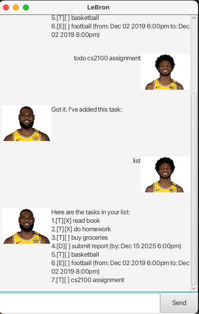

# LeBron User Guide



**LeBron** is a smart task management chatbot that helps you organize and track your todos, deadlines, and events. With an intuitive GUI interface, LeBron makes it easy to stay on top of your tasks and schedule.

## Quick Start

1. Launch the application
2. Type commands in the input field at the bottom
3. Press Enter or click "Send" to execute commands
4. View LeBron's responses and your task list in the chat area

## Features

### Adding Tasks

#### Adding a Todo Task
Add a simple todo task without any date constraints.

**Format:** `todo <description>`

**Example:**
```
todo read book
```

**Expected output:**
```
Got it. I've added this task:
  [T][ ] read book
Now you have 1 tasks in the list.
```

#### Adding a Deadline
Add a task with a specific deadline date and time.

**Format:** `deadline <description> /by <date-time>`

**Date formats supported:**
- `yyyy-mm-dd HHmm` (e.g., `2025-12-02 1800`)
- `yyyy-mm-dd` (defaults to end of day)

**Example:**
```
deadline submit report /by 2025-12-02 1800
```

**Expected output:**
```
Got it. I've added this task:
  [D][ ] submit report (by: Dec 02 2025 6:00pm)
Now you have 2 tasks in the list.
```

#### Adding an Event
Add an event with specific start and end times.

**Format:** `event <description> /from <start-time> /to <end-time>`

**Example:**
```
event team meeting /from 2025-12-02 1400 /to 2025-12-02 1600
```

**Expected output:**
```
Got it. I've added this task:
  [E][ ] team meeting (from: Dec 02 2025 2:00pm to: Dec 02 2025 4:00pm)
Now you have 3 tasks in the list.
```

### Managing Tasks

#### Listing All Tasks
Display all tasks in your list with their current status.

**Format:** `list`

**Expected output:**
```
Here are the tasks in your list:
1.[T][X] read book
2.[D][ ] submit report (by: Dec 02 2025 6:00pm)
3.[E][ ] team meeting (from: Dec 02 2025 2:00pm to: Dec 02 2025 4:00pm)
```

#### Listing Tasks on a Specific Date
Show only tasks that occur on a particular date.

**Format:** `list DD MM YYYY`

**Example:**
```
list 02 12 2025
```

#### Marking Tasks as Done
Mark a task as completed.

**Format:** `mark <task-number>`

**Example:**
```
mark 1
```

**Expected output:**
```
Nice! I've marked this task as done:
  [T][X] read book
```

#### Unmarking Tasks
Mark a completed task as not done.

**Format:** `unmark <task-number>`

**Example:**
```
unmark 1
```

**Expected output:**
```
OK, I've marked this task as not done yet:
  [T][ ] read book
```

#### Deleting Tasks
Remove a task from your list permanently.

**Format:** `delete <task-number>`

**Example:**
```
delete 2
```

**Expected output:**
```
Noted. I've removed this task:
  [D][ ] submit report (by: Dec 02 2025 6:00pm)
Now you have 2 tasks in the list.
```

### Searching Tasks

#### Finding Tasks by Keyword
Search for tasks that contain a specific keyword in their description.

**Format:** `find <keyword>`

**Example:**
```
find book
```

**Expected output:**
```
Here are the matching tasks in your list:
1.[T][ ] read book
```

#### Finding Tasks on a Specific Date
Find all deadlines and events that occur on a particular date.

**Format:** `on <date>`

**Date format:** `yyyy-mm-dd`

**Example:**
```
on 2025-12-02
```

**Expected output:**
```
Here are the tasks on Dec 02 2025:
1.[D][ ] submit report (by: Dec 02 2025 6:00pm)
2.[E][ ] team meeting (from: Dec 02 2025 2:00pm to: Dec 02 2025 4:00pm)
```

### Application Control

#### Exiting the Application
Close LeBron safely.

**Format:** `bye`

## Task Status Indicators

- `[T]` = Todo task
- `[D]` = Deadline task  
- `[E]` = Event task
- `[X]` = Task is completed
- `[ ]` = Task is not completed

## Data Storage

LeBron automatically saves your tasks to a local file, so your data persists between application sessions. Tasks are automatically loaded when you restart the application.

## Tips

1. **Task numbering:** Tasks are numbered starting from 1 in the order they appear in your list
2. **Date formats:** Use consistent date formats (yyyy-mm-dd) for best results
3. **Keywords:** The find command searches within task descriptions and is case-sensitive
4. **Time format:** Use 24-hour format for times (e.g., 1400 for 2:00 PM)

## Error Handling

LeBron will provide helpful error messages if:
- You enter an invalid command format
- You reference a non-existent task number
- You use an invalid date format
- You leave required fields empty

Simply follow the suggested format in the error message to correct your input.